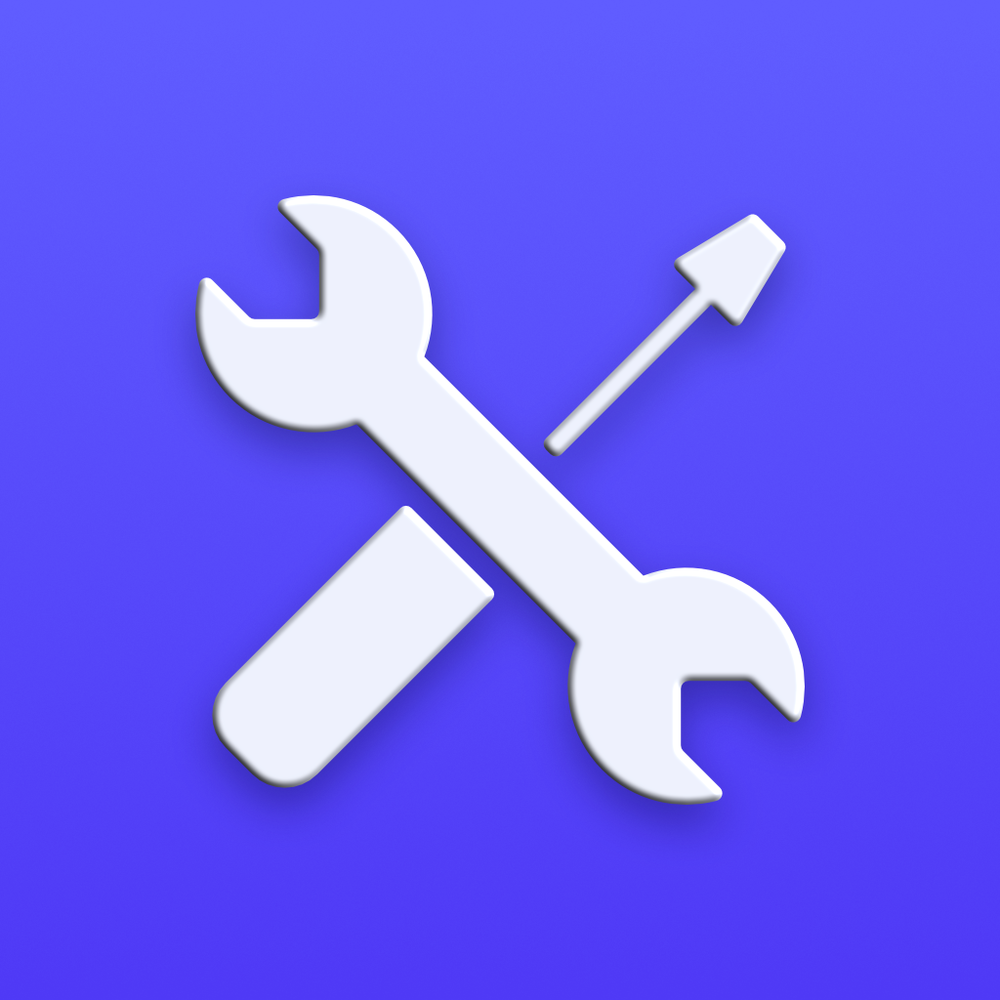

<a id="readme-top"></a>

<!-- PROJECT SHIELDS -->

[![GNU General Public License v3.0][license-shield]][license-url]
[![LinkedIn][linkedin-shield]][linkedin-url]
[![Personal Website][website-shield]][website-url]

<!-- PROJECT LOGO -->
<br />
<div align="center">
  <a href="https://github.com/lorenzofratus/piva-tools">
    
  </a>

<h3 align="center">P.IVA Tools</h3>

  <p align="center">
    This app is a (incomplete) collection of tools to help with the day-to-day operations of a professional operating with an Italian VAT number (aka Partita IVA).
    <br />
    <a href="https://piva-tools.pages.dev"><strong>Go to the app »</strong></a>
    <br />
    <br />
    <a href="https://github.com/lorenzofratus/piva-tools">Explore the docs</a>
    &middot;
    <a href="https://github.com/lorenzofratus/piva-tools/issues/new?labels=bug&template=bug-report---.md">Report Bug</a>
    &middot;
    <a href="https://github.com/lorenzofratus/piva-tools/issues/new?labels=enhancement&template=feature-request---.md">Request Feature</a>
  </p>
</div>

<!-- TABLE OF CONTENTS -->
<details>
  <summary>Table of Contents</summary>
  <ol>
    <li><a href="#disclaimer">Disclaimer</a></li>
    <li>
      <a href="#about-the-project">About The Project</a>
      <ul>
        <li><a href="#built-with">Built With</a></li>
      </ul>
    </li>
    <li>
      <a href="#getting-started">Getting Started</a>
      <ul>
        <li><a href="#prerequisites">Prerequisites</a></li>
        <li><a href="#installation">Installation</a></li>
      </ul>
    </li>
    <li>
      <a href="#usage">Usage</a>
      <ul>
        <li><a href="#forfeit-tax-calculator">Forfeit Tax Calculator</a></li>
      </ul>
    </li>
    <li><a href="#contributing">Contributing</a></li>
    <li><a href="#license">License</a></li>
    <li><a href="#contact">Contact</a></li>
  </ol>
</details>

<!-- DISCLAIMER -->

## Disclaimer

I am not a lawyer, accountant or tax advisor. This app is not intended to provide legal or financial advice. Always consult with a qualified professional for any legal or financial matters.

<p align="right">(<a href="#readme-top">back to top</a>)</p>

<!-- ABOUT THE PROJECT -->

## About The Project

I decided to create this app to help my friends with their day-to-day operations as freelancers in Italy. The app is still in its infancy, but I plan to add more features over time.

If you have any suggestions, feedbacks or ideas, please feel free to reach out to me.
I would love to hear from you!

The app is in Italian (for obvious reasons), but if you are interested in the english translation, I can provide it.

<p align="right">(<a href="#readme-top">back to top</a>)</p>

### Built With

- [![Next][Next.js]][Next-url]
- [![TailwindCSS][Tailwind]][Tailwind-url]
- [![DaisyUI][DaisyUI]][DaisyUI-url]

<p align="right">(<a href="#readme-top">back to top</a>)</p>

<!-- GETTING STARTED -->

## Getting Started

To get a local copy up and running follow these simple example steps.

### Prerequisites

To run this project you need to have Node.js and NPM installed on your machine.

The minimum version required is Node.js 18.x and NPM 9.x.

### Installation

1. Clone the repo
   ```sh
   git clone https://github.com/lorenzofratus/piva-tools.git
   ```
2. Install NPM packages
   ```sh
   npm install
   ```
3. Start the application in development mode
   ```sh
   npm run dev
   ```
4. Open your browser and go to `http://localhost:3000`
5. Build the application for production
   ```sh
   npm run build
   ```

<p align="right">(<a href="#readme-top">back to top</a>)</p>

<!-- USAGE EXAMPLES -->

## Usage

Here a brief description of each tool available in the app.

### Forfeit Tax Calculator

This tool helps you calculate the amount of tax you need to pay on a given income if you have a simplified tax regime (regime forfettario).

<p align="right">(<a href="#readme-top">back to top</a>)</p>

<!-- CONTRIBUTING -->

## Contributing

Contributions are what make the open source community such an amazing place to learn, inspire, and create. Any contributions you make are **greatly appreciated**.

If you have a suggestion that would make this better, please fork the repo and create a pull request. You can also simply open an issue with the tag "enhancement".
Don't forget to give the project a star! Thanks again!

1. Fork the Project
2. Create your Feature Branch (`git checkout -b feature/AmazingFeature`)
3. Commit your Changes (`git commit -m 'Add some AmazingFeature'`)
4. Push to the Branch (`git push origin feature/AmazingFeature`)
5. Open a Pull Request

<p align="right">(<a href="#readme-top">back to top</a>)</p>

### Top contributors:

<a href="https://github.com/lorenzofratus/piva-tools/graphs/contributors">
  
</a>

<!-- LICENSE -->

## License

Distributed under the GNU General Public License v3.0. See `LICENSE.txt` for more information.

<p align="right">(<a href="#readme-top">back to top</a>)</p>

<!-- CONTACT -->

## Contact

Lorenzo Fratus - info@lorenzofratus.it

Project Link: [https://github.com/lorenzofratus/piva-tools](https://github.com/lorenzofratus/piva-tools)

<p align="right">(<a href="#readme-top">back to top</a>)</p>

<!-- MARKDOWN LINKS & IMAGES -->

[license-shield]: https://img.shields.io/github/license/lorenzofratus/piva-tools.svg?style=for-the-badge
[license-url]: https://github.com/lorenzofratus/piva-tools/blob/main/LICENSE
[linkedin-shield]: https://img.shields.io/badge/-LinkedIn-black.svg?style=for-the-badge&logo=linkedin&colorB=555
[linkedin-url]: https://linkedin.com/in/lorenzo-fratus
[website-shield]: https://img.shields.io/badge/Website-%23048637.svg?style=for-the-badge&logo=data:image/svg+xml;base64,PD94bWwgdmVyc2lvbj0iMS4wIiBlbmNvZGluZz0iVVRGLTgiIHN0YW5kYWxvbmU9Im5vIj8+CjwhRE9DVFlQRSBzdmcgUFVCTElDICItLy9XM0MvL0RURCBTVkcgMS4xLy9FTiIgImh0dHA6Ly93d3cudzMub3JnL0dyYXBoaWNzL1NWRy8xLjEvRFREL3N2ZzExLmR0ZCI+Cjxzdmcgd2lkdGg9IjEwMCUiIGhlaWdodD0iMTAwJSIgdmlld0JveD0iMCAwIDI0IDI0IiB2ZXJzaW9uPSIxLjEiIHhtbG5zPSJodHRwOi8vd3d3LnczLm9yZy8yMDAwL3N2ZyIgeG1sbnM6eGxpbms9Imh0dHA6Ly93d3cudzMub3JnLzE5OTkveGxpbmsiIHhtbDpzcGFjZT0icHJlc2VydmUiIHhtbG5zOnNlcmlmPSJodHRwOi8vd3d3LnNlcmlmLmNvbS8iIHN0eWxlPSJmaWxsLXJ1bGU6ZXZlbm9kZDtjbGlwLXJ1bGU6ZXZlbm9kZDsiPgogICAgPHBhdGggZD0iTTIuNSwxMkMyLjUsNy41MjIgMi41LDUuMjgyIDMuODkxLDMuODkxQzUuMjgyLDIuNSA3LjUyMiwyLjUgMTIsMi41QzE2LjQ3OCwyLjUgMTguNzE4LDIuNSAyMC4xMDksMy44OTFDMjEuNSw1LjI4MiAyMS41LDcuNTIyIDIxLjUsMTJDMjEuNSwxNi40NzggMjEuNSwxOC43MTggMjAuMTA5LDIwLjEwOUMxOC43MTgsMjEuNSAxNi40NzgsMjEuNSAxMiwyMS41QzcuNTIyLDIxLjUgNS4yODIsMjEuNSAzLjg5MSwyMC4xMDlDMi41LDE4LjcxOCAyLjUsMTYuNDc4IDIuNSwxMloiIHN0eWxlPSJmaWxsOm5vbmU7ZmlsbC1ydWxlOm5vbnplcm87c3Ryb2tlOndoaXRlO3N0cm9rZS13aWR0aDoxLjVweDsiLz4KICAgIDxnIHRyYW5zZm9ybT0ibWF0cml4KDEuMiwwLDAsMS4yLC02LjY2NTYsLTQuOCkiPgogICAgICAgIDxwYXRoIGQ9Ik0yMSwxNEwxOSwxNEMxOC42ODIsMTQgMTguMzk5LDE0LjE0OCAxOC4yMTYsMTQuMzc5QzE4LjA4MSwxNC41NSAxOCwxNC43NjUgMTgsMTVMMTgsMTYuNU0xOCwxNi41TDE4LDE5TTE4LDE2LjVMMjAuNSwxNi41IiBzdHlsZT0iZmlsbDpub25lO2ZpbGwtcnVsZTpub256ZXJvO3N0cm9rZTp3aGl0ZTtzdHJva2Utd2lkdGg6MS4yNXB4O3N0cm9rZS1saW5lY2FwOnJvdW5kO3N0cm9rZS1saW5lam9pbjpyb3VuZDsiLz4KICAgIDwvZz4KICAgIDxnIHRyYW5zZm9ybT0ibWF0cml4KDEuMiwwLDAsLTEuMiwtMTMuMiwzNC44KSI+CiAgICAgICAgPHBhdGggZD0iTTIxLDE0TDE5LDE0QzE4LjY4MiwxNCAxOC4zOTksMTQuMTQ4IDE4LjIxNiwxNC4zNzlDMTguMDgxLDE0LjU1IDE4LDE0Ljc2NSAxOCwxNUwxOCwxNi41TTE4LDE2LjVMMTgsMTkiIHN0eWxlPSJmaWxsOm5vbmU7ZmlsbC1ydWxlOm5vbnplcm87c3Ryb2tlOndoaXRlO3N0cm9rZS13aWR0aDoxLjI1cHg7c3Ryb2tlLWxpbmVjYXA6cm91bmQ7c3Ryb2tlLWxpbmVqb2luOnJvdW5kOyIvPgogICAgPC9nPgo8L3N2Zz4K
[website-url]: https://lorenzofratus.it
[product-screenshot]: images/screenshot.png
[Next.js]: https://img.shields.io/badge/next.js-000000?style=for-the-badge&logo=nextdotjs&logoColor=white
[Next-url]: https://nextjs.org/
[Tailwind]: https://img.shields.io/badge/tailwindcss-%2338B2AC.svg?style=for-the-badge&logo=tailwind-css&logoColor=white
[Tailwind-url]: https://tailwindcss.com/
[DaisyUI]: https://img.shields.io/badge/daisyui-5A0EF8?style=for-the-badge&logo=daisyui&logoColor=white
[DaisyUI-url]: https://daisyui.com/
